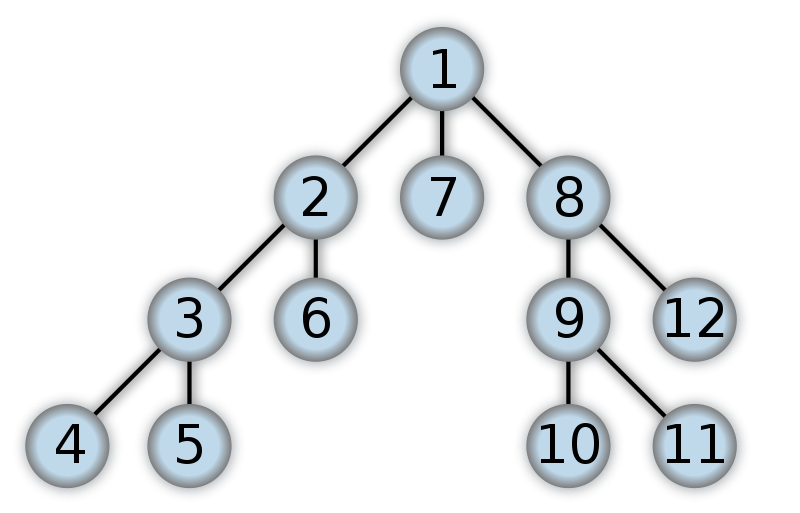

## Why Graph is used to test knowledge algorithm?

Graph naturally represent relasionship between entities, making them ideal for modeling complex networks. Each node(or vertex ) in a graph can represent an entity, and each edge can represent the relationship or connection between two entities and theirs relationships can be directly mapped onto a graph structure.

For thoses reasons Graph is widely used to create complex algorithms. These algorithms can be applied to knowledge graph to extract insights, discover hidden patterns, indentify clusters of related informatio, or evaluate the importance of certain nodes within network


## How to traverse a graph?


To traverso a Graph exist multiples way the most used are DFS(Deep First Search) and BFD(Breath fist Search)


## Traverse graph using Deep First Search


1. Start at the Root: Begin the traversal from the root node of the binary tree. The "root" is the topmost node, where the tree structure originates.

2. Traverse Left: From the current node, move to the left subtree and continue this process recursively. This means you keep going to the left child of each subsequent node until you reach a node that does not have a left child.

3. Visit Node: Once you reach a node with no left child, "visit" that node. Visiting typically involves performing an operation such as printing the node's value or storing it for later use. This is your "current node" at this stage.

4. Traverse Right: After visiting the current node, proceed to its right child if it exists, and then immediately continue to the leftmost node in this right subtree, repeating the process from step 2.

5. Repeat Until Done: This process of going left, visiting the node, and then going right continues until every node in the tree has been visited exactly once.





Now we gonna traversal a Graph Using Golang


```go
package main

import "fmt"

type TreeNode struct {
	Val   int
	Left  *TreeNode
	Right *TreeNode
}

// A helper function that creates a new TreeNode and returns a pointer to it.
func NewNode(value int) *TreeNode {
	return &TreeNode{Val: value}
}

// AddLeftEdge adds a left child to a parent node.
func AddLeftEdge(parent, child *TreeNode) {
	parent.Left = child
}

// AddRightEdge adds a right child to a parent node.
func AddRightEdge(parent, child *TreeNode) {
	parent.Right = child
}

func valuesTraversalDFS(node *TreeNode) []int {
	var result []int
	var travesalNode func(node *TreeNode)
	travesalNode = func(node *TreeNode) {
		if node == nil {
			return
		}
		result = append(result, node.Val)
		travesalNode(node.Left)
		travesalNode(node.Right)
	}
	travesalNode(node)
	return result
}

func main() {
	// Create TreeNodes for each value in the graph.
	// This is a direct translation of the visual graph you've provided.
	// The nodes are named for their values to keep it clear.
	n1 := NewNode(1)
	n2 := NewNode(2)
	n3 := NewNode(3)
	n4 := NewNode(4)
	n5 := NewNode(5)
	n6 := NewNode(6)
	n7 := NewNode(7)
	n8 := NewNode(8)
	n9 := NewNode(9)
	n10 := NewNode(10)
	n11 := NewNode(11)
	n12 := NewNode(12)

	// Connect nodes as per the graph.
	// Assuming it is a binary tree structure as described by the TreeNode struct.
	AddLeftEdge(n1, n2)
	AddRightEdge(n1, n7)

	AddLeftEdge(n2, n3)
	AddRightEdge(n2, n6)

	AddLeftEdge(n3, n4)
	AddRightEdge(n3, n5)

	AddRightEdge(n7, n8)

	AddLeftEdge(n8, n9)
	AddRightEdge(n8, n12)

	AddLeftEdge(n9, n10)
	AddRightEdge(n9, n11)

	fmt.Println(valuesTraversalDFS(n1))
}
```